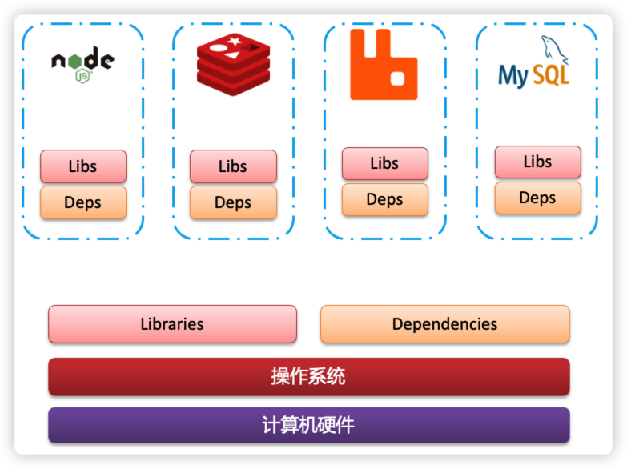
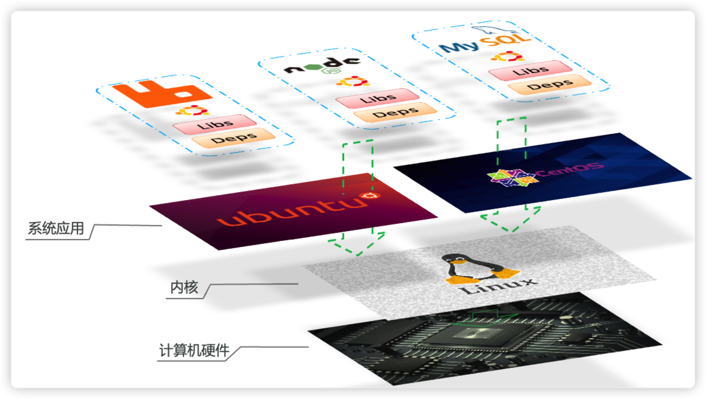
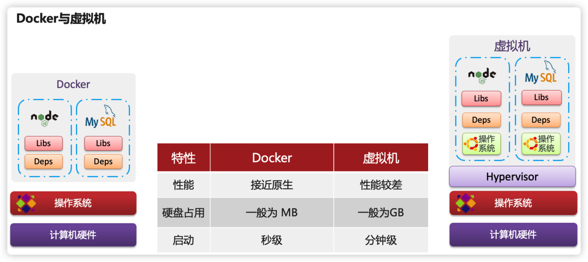
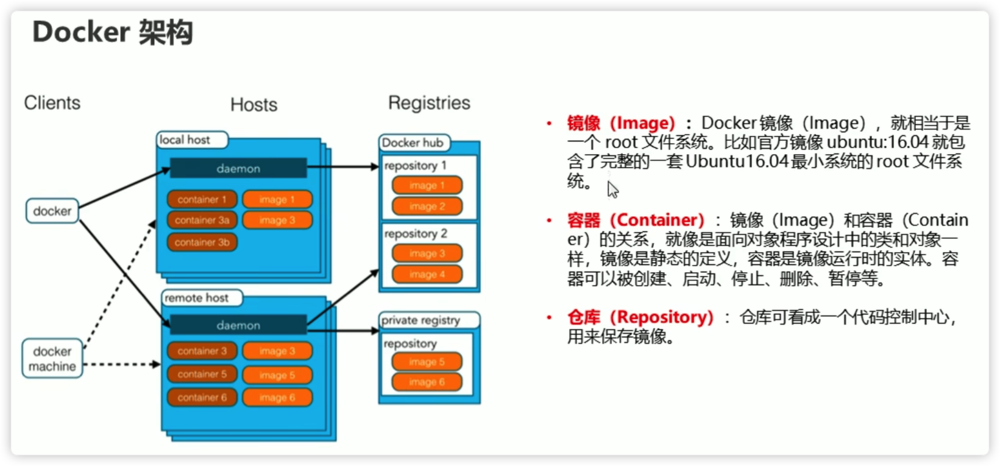
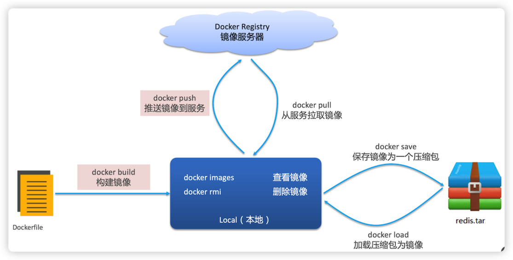

<!-- SPbSTU 报告起始 -->

<div align="center">
  <!--  新式 π logo -->
   <!-- 研究型大学 logo -->
  </br>
  <b><font size=3>Санкт-Петербургский политехнический университет Петра Великого</font></b>
  </br>
  <b><font size=2>Институт компьютерных наук и технологий</font></b>
  </br>
  <b><font size=2>Высшая школа программной инженерии</font></b>
</div>


<div align="center">
<b><font size=6>Docker 学习笔记</font></b>


[](LICENSE)

</div>
<div align=left>
<div STYLE="page-break-after: always;"></div>
<!-- SPbSTU 报告结束 -->


[toc]

# Docker

## 简介

> Docker 是一种容器技术，解决软件跨环境迁移的问题。Docker 可以减少运维部署相关的成本。不需要写代码，基本都是 Linux 命令的操作。

**Docker是一个开源的应用容器引擎，是一个快速交付应用、运行应用的技术，让开发者可以打包他们的应用以及依赖包到一个可移植的容器中，然后发布到任何流行的Linux机器上，也可以实现虚拟化，容器是完全使用沙箱机制，相互之间不会有任何接口。**

Docker 概念：

- Docker 是一个开源的应用容器引擎
- 基于 Go 语言实现
- Docker 可以让开发者打包自己的应用以及环境依赖包到一个轻量级、可移植的容器中，然后发布到任何流行的 Linux 机器上
- 容器使用沙箱机制，相互隔离
- 容器性能开销极低
- ==Docker 直接调用各个 Linux 系统发行版本的 **Linux内核**，而不是包含一整个操作系统==


**Docker 如何解决依赖的兼容问题的？**

- 将应用的Libs（函数库）、Deps（依赖）、配置与应用一起打包

- 将每个应用放到一个隔离**容器**去运行，避免互相干扰



这样打包好的应用包中，既包含应用本身，也保护应用所需要的Libs、Deps，无需再操作系统上安装这些，自然就不存在不同应用之间的兼容问题了。

虽然解决了不同应用的兼容问题，但是开发、测试等环境会存在差异，操作系统版本也会有差异，怎么解决这些问题呢？


**Docker如何解决不同系统环境的问题？**

- Docker将用户程序与所需要调用的系统(比如Ubuntu)==函数库==一起打包

- Docker运行到不同操作系统时，直接基于打包的库函数，借助于操作系统的Linux内核来运行

    


**Docker 如何解决大型项目依赖关系复杂，不同组件依赖的兼容性问题？**

- Docker允许开发中将应用、依赖、函数库、配置一起**打包**，形成可移植==镜像==

- Docker应用运行在==容器==中，使用沙箱机制，相互**隔离**


**Docker如何解决开发、测试、生产环境有差异的问题**

- Docker镜像中包含完整运行环境，包括系统函数库，仅依赖系统的Linux内核，因此可以在任意Linux操作系统上运行


## Docker 与虚拟机

虚拟机（virtual machine）是在操作系统中模拟硬件设备，然后运行另一个操作系统，比如在 Windows 系统里面运行 Ubuntu 系统，这样就可以运行任意的Ubuntu应用了。

**Docker**仅仅是封装函数库，并没有模拟完整的操作系统，如图：



**Docker和虚拟机的差异：**

- ==docker是一个系统进程==；虚拟机是在操作系统中的操作系统

- docker体积小、启动速度快、性能好；虚拟机体积大、启动速度慢、性能一般


# 架构

**镜像和容器**

- **镜像（Image）**：Docker将应用程序及其所需的依赖、函数库、环境、配置等文件打包在一起，称为镜像。镜像都是只读的，容器只能读镜像中的文件，不能进行写操作
- **容器（Container）**：镜像中的应用程序运行后形成的进程就是**容器**，只是Docker会给容器做隔离，对外不可见，避免污染镜像。容器会以为自己是这个主机上唯一的进程


**Docker是一个CS架构的程序，由两部分组成：**

- **服务端（server）**： Docker守护进程，负责处理Docker指令，管理镜像、容器等
- **客户端（client）**： 通过命令或RestAPl向Docker服务端发送指令。可以在本地或远程向服务端发送指令。



- `daemon` - 是守护进程，控制开启关闭或者开始 Docker 容器


**DockHub**：一个镜像托管的服务器，类似的还有阿里云镜像服务，统称为 **DockerRegistry （镜像服务器）**。我们一方面可以将自己的镜像共享到DockerHub，另一方面也可以从DockerHub拉取镜像：


# Docker 服务相关命令

## 守护进程 (daemon)

> 基于 CentOS 7

| 命令                     | 说明                |
| ------------------------ | ------------------- |
| systemctl start docker   | 启动 Docker         |
| systemctl status docker  | docker 状态         |
| systemctl stop docker    | 关闭 docker         |
| systemctl restart docker | 重启 docker         |
| systemctl enable docker  | 开机自动启动 docker |

## 镜像 (image)

镜像内部涵盖了一个最小操作系统和我们的程序及依赖包

### 镜像名称

首先来看下镜像的名称组成：

- 镜名称一般分两部分组成：[repository]:[tag]。
- 在没有指定tag时，默认是latest，代表最新版本的镜像

如图：


这里的mysql就是repository，5.7就是tag，合一起就是镜像名称，代表5.7版本的MySQL镜像。

### 命令

| 命令                                         | 说明                                                     |
| -------------------------------------------- | -------------------------------------------------------- |
| `docker images`                              | 查看本地镜像（列表）。输出表格中的 `latest` 代表最新版本 |
| `docker search IMAGE_NAME`                   | 搜索镜像（远程镜像库）                                   |
| `docker pull IMAGE_NAME:TAG`                 | 拉取镜像，不写版本`TAG`代表最新版 `latest`               |
| `docker rmi IMAGE_ID 或者 IMAGE_NAME:TAG`    | 删除镜像（rm 代表 remove，i 代表 image）                 |
| `docker save -o 指定文件.tar IMAGE_NAME:TAG` | 保存镜像（`-o`代表 output 至 tar 文件）                  |
| `docker load -i 读取的文件.tar`              | 读取镜像                                                 |


可以使用命令组合，使用 "`"（Tab 键上面那个符号）可以在一个命令里使用另一个命令的结果。比如：

- `docker images -q` 代表输出所有本地镜像的 id 号
- `docker rmi IMAGE_ID` 代表删除一个镜像

他们“撇”组合之后的代表删除本地所有镜像：

```bash
 docker rmi `docker images -q`
```


## 容器 (container)

容器是通过镜像创建的，这节就是创建并操作容器



### **创建容器**

`docker run -参数 --name=容器自定义名字 -p 宿主机端口:容器端口 IMAGE:TAG /bin/bash`

- `-i` 保持容器**始终运行**，通常 与`-t` 同时使用。加入`-it`这两个参数后，容器创建后自动进入容器中，退出容器后，容器自动关闭。

- `-t` 为容器重新分配一个伪输入终端，通常与`-i`同时使用。

    通过 `-it` 创建的容器，退出后会立刻关闭

- `-d` 以守护(后台)模式运行容器。创建一个容器在后台运行，需要使用 docker exec 进入容器。**退出后，容器不会关闭**

    通过 `-id` 创建的容器，退出后会**不会**关闭

- `-p` 将宿主机端口与容器端口映射，冒号左侧是宿主机端口，右侧是容器端口

- `/bin/bash` 初始化指令可以替换成别的


`-it` 创建的容器一般称为交互式容器，`-id` 创建的容器一般称为守护式容器


### **查看容器**

`docker ps -参数`

- 如果不加参数只输出**正在运行的容器**
- `-a` 输出所有容器


### 其他命令

| 命令                                                         | 说明                                                         |
| ------------------------------------------------------------ | ------------------------------------------------------------ |
| `docker run -参数 --name=容器自定义名字 IMAGE:TAG /bin/bash` | 创建容器，并让其运行                                         |
| `docker pause `                                              | **暂停**容器（挂起进程）                                     |
| `docker unpause`                                             | 取消暂停容器                                                 |
| `docker ps -参数`                                            | 查看所有运行容器及其状态                                     |
| `docker start 容器名`                                        | **启动**容器                                                 |
| `docker exec -it 容器名字 /bin/bash`                         | 进入容器                                                     |
| `docker stop 容器名`                                         | **停止**容器（杀死进程）                                     |
| `docker rm 容器名或ID`                                       | 删除指定容器                                                 |
| `docker imspect 容器名`                                      | 查看容器信息                                                 |
| `docker logs 容器名`                                         | 查看日志，`-f` 代表持续跟踪（follow）日志，按 Ctrl+C 退出日志跟踪，但不会关闭容器 |
|                                                              |                                                              |
|                                                              |                                                              |
|                                                              |                                                              |


### 容器中的数据卷


